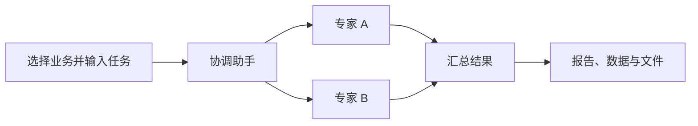

# openAgents

**一套底座，承载你的下一项智能体业务。**

用工具连接业务系统，用完整 System Prompt 定义智能体，用 Skills 沉淀业务方法。openAgents 提供统一的对话、专家协作、操作确认和成果交付界面，让你把开发精力放在业务能力上。

今天接入研究助手，明天增加运营助手，再为新的业务配置自己的工具和工作方法。它们共用同一套平台，各自拥有独立的角色、工具与 Skills。

适合个人开发者与可信内部团队自托管使用。基于 OpenHands SDK 和 Canvas 构建，当前为开发版本。

[快速开始](#快速开始) · [接入你的业务](#接入你的业务) · [架构文档](canvas/docs/general-agent-foundation.md) · [验证记录](VALIDATION.md)

## 从一个任务，到一份可交付的成果

| 你需要的能力             | openAgents 已提供                                            |
| ------------------------ | ------------------------------------------------------------ |
| 同一平台运行多个业务助手 | 导入业务包，选择智能体，使用各自完整的 Prompt、工具和 Skills |
| 把复杂任务分给专家       | 协调助手委派任务，专家独立执行，返回结果后由主助手汇总       |
| 对关键操作保留决定权     | 按工具策略请求确认，在会话中查看、批准或拒绝；服务端执行规则 |
| 拿到文件和结构化结果     | 统一管理上传文件与生成成果，报告可下载，刷新后仍可访问       |
| 看清任务进行到哪里       | 展示主任务、子任务、等待确认和执行结果；保留记录供人工恢复   |
| 为业务增加专属界面       | 可选扩展输入表单和结果卡片，复用宿主的会话、文件与任务能力   |



每个专家使用自己的配置和工作目录。业务声明允许调用的工具、需要确认的操作和可委派的专家；成果通过明确的文件引用交接。

## 先体验两个完整示例

仓库提供两个业务包，展示如何用不同配置复用同一套执行与交付流程。

| 示例         | 可以输入的任务                                   | 助手如何协作                                           | 最终交付               |
| ------------ | ------------------------------------------------ | ------------------------------------------------------ | ---------------------- |
| **研究简报** | “比较两个方案，整理证据、风险和建议，生成简报。” | 证据分析与风险评审两位专家分别工作，协调助手汇总       | 可下载的 Markdown 报告 |
| **运营复盘** | “检查当前队列和操作手册，评估是否需要升级处理。” | 指标分析与操作手册评审两位专家协作，必要时请求创建工单 | 复盘报告与演示工单结果 |

两个示例使用演示数据。研究示例读取预置证据，运营示例在创建演示升级工单前需要确认，不连接真实工单系统。替换这些工具，即可接入自己的数据与服务。

还提供一个可选的[业务界面示例](software-agent-sdk/examples/agent_foundation/ui/README.md)：用表单提交任务，用结果卡片展示摘要、数据和成果文件。

## 快速开始

### 1. 准备环境并启动

准备 **Node.js 24+** 和 **uv**。SDK 支持 Python 3.12+，仓库默认使用 Python 3.13。首次安装涉及 LiteLLM 的 Rust 扩展，需要可用的 Rust 构建工具。

**Windows 可以运行。** 本地运行、自动验收和启动冒烟已在 Windows x64 完成；全新依赖安装仍有构建限制，部署前请阅读下面的说明。

```sh
git clone https://github.com/study-wzl/openAgents.git
cd openAgents
npm run setup
npm start
```

打开 **http://127.0.0.1:8000**。启动器仅监听本机；`Ctrl+C` 停止本次启动的进程，历史记录保留。

<details>
<summary>Windows 与首次安装说明</summary>

Windows 验证环境中，锁定的 LiteLLM 1.93.0 Rust 构建未完成，测试使用了同版本源码的纯 Python 路径。启动器冒烟复用了已经准备好的依赖，因此尚不能承诺全新 Windows 环境下 `npm run setup` 一次成功。

全新部署建议使用 Linux 或 WSL2，完成锁定依赖的正常安装。该建议针对依赖准备；Windows 上的实际运行和测试结果见[验证记录](VALIDATION.md)。

</details>

### 2. 配置模型

在设置的模型 **Profiles** 中保存一个名为 **`business`** 的模型配置，并配置对应的服务端密钥。示例包会引用它；日常使用需要可访问的模型服务。

### 3. 安装示例业务

在首页输入业务包的**服务端绝对路径**，校验并安装。以下为目录位置，请替换为你的实际路径：

```text
<本仓库>/software-agent-sdk/examples/agent_foundation/research
<本仓库>/software-agent-sdk/examples/agent_foundation/operations
```

例如 Windows 上的研究包路径可以是 `D:/github-project/openAgents/software-agent-sdk/examples/agent_foundation/research`。路径指向运行 Agent Server 的机器。

### 4. 选择助手，提交任务

选择研究或运营的协调助手，输入上面的示例任务。在会话中查看专家进度，处理需要确认的操作，完成后从成果面板下载报告。

可选的业务表单与结果卡片需要在 Canvas Apps 中**独立安装并启用**示例扩展。无需安装扩展也能使用通用会话、任务、确认和成果界面。

运行数据默认保存在 `.runtime/`，产品遥测默认关闭。端口、状态目录和额外工具模块可通过 `.env` 配置，参见 [`.env.example`](.env.example)。

## 接入你的业务

业务包负责组合智能体的能力，底座负责执行和交付。可以从[研究包](software-agent-sdk/examples/agent_foundation/research)或[运营包](software-agent-sdk/examples/agent_foundation/operations)复制开始。

| 你定义            | 用途                                                      |
| ----------------- | --------------------------------------------------------- |
| **工具**          | 连接数据源与业务系统；支持 MCP 和部署时注册的 Python 工具 |
| **System Prompt** | 完整定义角色、目标、协作方式和交付要求                    |
| **Skills**        | 用 `SKILL.md` 和配套资源沉淀方法，按需加载正文            |
| **业务包清单**    | 指定版本、模型引用、工具、Skills、委派名单与操作策略      |
| **可选界面扩展**  | 为业务提供输入表单和结果卡片                              |

```text
my-business/
├── agent-package.json    # 业务身份、智能体与能力配置
├── prompts/              # 完整 System Prompt
├── skills/               # SKILL.md 与配套资源
└── evals/                # 自己的业务验收用例
```

接入过程：

1. **定义角色。** 修改包 ID、版本、入口智能体和完整 Prompt，准备业务 Skills。
2. **连接工具。** 引用允许使用的 MCP 工具，或先在部署环境安装、注册 Python 工具，再在清单中引用注册名。自有模块可通过 `.env` 的 `OPENAGENTS_TOOL_MODULES` 与 `OH_EXTRA_PYTHON_PATH` 加载。
3. **声明执行规则。** 为工具配置确认、超时和取消策略，列出允许委派的专家。凭据只保留服务端引用。
4. **导入并验证。** 在首页校验、安装业务包，运行自己的验收用例；需要专属界面时，再安装并启用 Canvas Extension。

业务 Prompt 完整替换编程默认提示词，工具和 Skills 显式选择，不继承全局插件或长期记忆。包更新只影响新任务，历史保留实际使用的版本与资源。运行任务时不会自动安装工具依赖或执行包内任意 Python 代码。

## 架构与当前边界

**业务包**定义能力，**Canvas** 提供交互界面，**Agent Server** 管理任务、确认和成果，并通过 **OpenHands SDK** 执行模型与工具循环。仓库包含配套修改后的后端、TypeScript 客户端和前端，可一起构建运行。

当前版本面向可信团队的**单 Agent Server 实例**，支持**一层委派、最多四个并行专家**。服务重启后保留记录，由用户决定恢复；结果不明的外部写操作必须先核实，再记录结果并显式继续。停止任务不会撤销已经发生的外部操作。

包版本保存 Prompt、Skills 和配置资源；模型服务、Python 依赖与远程 MCP 属于部署环境，变化后可能需要迁移才能恢复旧任务。自动恢复长任务、多租户、通用流程编辑器和定时调度不在当前交付范围。

**请使用仓库随附的本地 SDK。** 新契约尚未发布到上游包；首期新业务验收覆盖自托管 OpenHands 路径。公共库导出保留兼容，Cloud、ACP 和自动化的底层代码仍保留。

## 开发与验证

完成 `npm run setup` 后，可在仓库根目录运行：

```sh
npm test
npm run build
npm --prefix canvas run lint
npm --prefix canvas run check-translation-completeness
npm --prefix canvas run test:e2e:foundation
```

`npm run build` 会准备本地 SDK 客户端，再构建 Canvas 应用和公共库。重装依赖或修改 SDK 后，应重新执行它。

浏览器验收前，在 `canvas/` 中执行 `npx playwright install chromium`。验收使用**真实 Agent Server、SDK 会话、工具和持久化服务**，模型响应使用确定性替身；覆盖专家协作、确认、刷新与成果下载。尚未验证真实在线模型供应商和业务账号。

本地验证已通过 Canvas 全量 8,099 项、后端组合 576 项、TypeScript 客户端 349 项测试，以及真实后端浏览器验收、应用和库构建。聚焦回归、保留的跳过项与环境限制详见 [VALIDATION.md](VALIDATION.md)。

| 深入了解                     | 入口                                                                      |
| ---------------------------- | ------------------------------------------------------------------------- |
| 设计决策、运行契约与恢复边界 | [架构文档](canvas/docs/general-agent-foundation.md)                       |
| 行为规格与验收要求           | [规格文档](canvas/specs/general-agent-foundation.md)                      |
| 两个业务包与后端用法         | [示例说明](software-agent-sdk/examples/agent_foundation/README.md)        |
| 表单、结果卡片与扩展接入     | [业务界面示例](software-agent-sdk/examples/agent_foundation/ui/README.md) |
| 本地测试结果与可复现命令     | [验证记录](VALIDATION.md)                                                 |

## 开源与来源

本项目基于 MIT 开源的 OpenHands，保留上游源码、许可证和版本信息。来源与基础版本见 [UPSTREAM.md](UPSTREAM.md)，许可证见 [LICENSE](LICENSE)。
