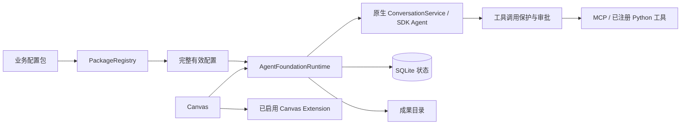

# 通用 Agent 底座

本改造保留 OpenHands SDK 执行循环、会话事件与 Canvas Extension。业务通过完整 system prompt、明确的工具和 Skills 接入；任务、审批、成果属于 Agent Server。首期面向可信团队、单实例自托管部署。服务重启保留记录，由用户手动恢复，不自动重放业务操作。

## 代码与运行边界

| 仓库 | 实现 |
| --- | --- |
| `software-agent-sdk` | `agent_foundation` 包管理、统一配置解析、SQLite 任务/调用/审批/成果、SDK dispatch 保护、规范 REST 接口、TypeScript 客户端 |
| `OpenHands` | 本文、行为规格、业务智能体首页、通用会话和历史、任务/审批/成果面板、Canvas Extension 结果渲染、开发接入 |



不新增第二套模型循环或事件协议。`FoundationAgent` 在原有 step/工具 dispatch 边界执行服务端策略。普通 Agent 的默认行为与库导出保留；应用的 Local 路径使用通用界面，Cloud 保留兼容界面。

## 本地开发接入

当前改动跨两个仓库，开发期间使用本地 SDK。发布需先发布 Agent Server 和 TypeScript 客户端，再通过 npm 同步 Canvas 的精确依赖与锁文件；本地准备脚本不构成已发布的新版本。

1. 将修改后的 `software-agent-sdk` 与本仓库放在相邻目录；安装 Node 24+、Python 3.12+ 和 uv。
2. 在 SDK 目录执行 `uv sync --group dev`；在 `clients/typescript` 执行 `npm ci`。
3. Canvas 执行 `npm ci`，设置 `OH_AGENT_SERVER_LOCAL_PATH` 为 SDK 的绝对路径，然后执行 `npm run sdk:local`。它编译规范客户端并准备到本地 `node_modules`；再次 `npm ci` 会恢复发布版本。
4. 按现有启动方式运行自托管服务。运行示例工具时，用 SDK 的 `python -m examples.agent_foundation.serve` 启动 Agent Server，使部署工具完成注册。
5. Canvas 首页填写 **服务端** 的业务包绝对目录，校验、安装、启用，然后启动任务。

兼容下限提高到 `1.50.1`，新增功能由服务端 `general_agent_foundation_v1` 能力及规范接口识别。仅版本号相同的旧发布服务不具备新功能。干净安装的发布客户端也不含开发中的新 API，发布前必须按上述依赖顺序完成版本切换。

Windows 验证环境中，锁定 LiteLLM 1.93.0 的 Rust 扩展构建受限；后端测试使用同版本源码的 Python 路径。此验证不替代生产部署的完整依赖安装。

## 业务包

```text
business-package/
  agent-package.json
  prompts/
  skills/                 # SKILL.md 及资源
  tools/                  # 可选部署源码，运行中不会自动安装
  ui/                     # 可选独立 Canvas Extension
  evals/
```

示例最小清单：

```json
{
  "schema_version": 1,
  "id": "research",
  "version": "1.0.0",
  "name": "研究助手",
  "entry_agents": ["coordinator"],
  "agents": [{
    "id": "coordinator",
    "name": "研究主助手",
    "llm_profile_ref": "business",
    "system_prompt": "prompts/coordinator.md",
    "tools": [],
    "skills": ["skills/review/SKILL.md"],
    "mcp_server_refs": [],
    "mcp_tools": [],
    "secret_refs": [],
    "delegates": [],
    "tool_policies": {}
  }]
}
```

`llm_profile_ref` 指向服务端模型配置；`tools` 引用部署时注册的 SDK 工具；`mcp_server_refs` 指向服务端 MCP 配置，`mcp_tools` 限定模型可使用的具体广告工具名，空列表不授权任何 MCP 工具。清单不保存凭据。

安装采用资源快照和内容摘要；同一版本不能替换成不同内容。更新版本影响新任务；已创建任务按原包版本解析。智能体 ID 为 `包ID/智能体ID`，Profile ID 由此稳定生成，不能通过普通可变 Profile 编辑路径覆盖包配置。查看有效配置使用 `/api/agent-foundation/agents/{package_id}/{agent_id}/config?version=...`。

完整 prompt 替换 coding 默认 prompt。业务配置使用显式 Skills 来源，关闭自动项目/用户/公共 Skills、环境插件、全局长期记忆和自动兜底工具。有效配置列出主、子智能体实际可用的控制工具。`invoke_skill` 按需加载正文，`read_package_resource` 只读当前固定版本包内的 UTF-8 配套资源（最多 256 KiB，拒绝路径越界），`read_artifact` 读取明确授权的用户文件。Skills 脚本不自动执行，业务必须声明相应执行工具。

禁用或卸载阻止新任务，历史元数据与成果保留。历史包内容与原环境仍可用时才能恢复；工具或依赖不兼容时阻止继续。配置摘要可追溯不等于远程工具、模型、Python 依赖永久可复现。

SDK `examples/agent_foundation/research` 与 `operations` 提供两个不同业务、主助手和两个专家，以及完整 prompt/Skills。部署工具只操作演示数据及任务目录。验收不需要真实业务账号。

## 任务、委派与工具操作

任务唯一写入者是 `AgentFoundationRuntime`/`FoundationStore`。SQLite 位于 `$OH_PERSISTENCE_DIR/agent-foundation/runtime.sqlite3`，工作目录和成果目录分别保存。SDK 独立保存会话历史。

状态为 `queued`、`running`、`waiting_for_confirmation`、`cancelling`、`completed`、`failed`、`cancelled`、`interrupted`。创建请求必须携带稳定 `idempotency_key`；重复请求返回同一个任务，相同键改变内容会失败。

主助手以 `delegate_agent` 工具调用明确许可的专家。一层委派、最多四个并行子任务，每个子任务拥有独立真实会话和工作目录。主助手复用 SDK 原生并行工具执行器，同一轮多个委派可以同时等待审批。专家仅接收说明及明确成果引用，使用自己的 prompt、工具、Skills 和凭据引用。成果交接不依赖 Git。

工具策略包含 `requires_confirmation`、`timeout_seconds` 和 `cancellable`。默认需要确认；明确只读的示例工具直接执行。审批绑定任务、调用 ID、参数和配置版本，在 SQLite 提交后才执行；重复批准不会重复调用，拒绝不执行。Python 与 MCP 共用执行保护。

停止传播到子任务。调用无法中止时，任务保持“正在停止”，实际调用结束后才变为停止；停止不能声称撤销已产生的外部效果。超时发出停止请求，并保留结果不明的写调用状态。

重启将未完成执行标为中断，保留待审批记录与未完成 Action，不由原生恢复逻辑提前消费审批。恢复使用原任务 ID，检查原版本及工具兼容性；已完成调用使用持久化结果。主任务和直接子任务的未知写调用都会阻止主任务继续执行或重新委派。用户必须先核实外部操作的真实结果，在对应任务填写依据并记录决定，再独立恢复；子任务的人工核实结论同时写入父会话。

## 成果与业务界面

`ArtifactRef` 包含标识、所属会话/任务、文件名、类型、大小、版本。上传、`publish_artifact` 与读取工具通过服务登记和授权访问，不向浏览器提供任意服务器路径。工作目录文件需要显式发布才作为成果保留；清理工作目录不能删除已登记成果。

任务结果保留原始工具观察事件，并提供 `package_id`、`tool_name`、`schema_version`、`data`、`text`、`artifacts` 结果封装。SDK 原生事件仍是会话记录来源；前端刷新/重连重新读取持久化状态和成果。

Local 应用首页选择业务智能体，历史列表保留旧记录，会话展示消息、子任务、精确审批和成果。旧 coding 页签地址落到通用页面，旧记录在未转换为兼容业务任务前只读。公共库中的原有组件、接口与 Cloud/ACP 底层保留。

可选业务 UI 仍是单独安装、显式启用的 Canvas Extension。宿主提供创建任务、发送输入、上传成果、读取任务的方法，不传模型凭据。结果渲染器在清单 `contributes.result_renderers` 声明，按业务包/工具名/结构版本精确匹配；重复作用域拒绝注册。扩展禁用、缺失、激活/渲染失败时回退文本、JSON 与文件列表，结果数据不依赖扩展保存。

`ui_extension_ref` 是描述性引用，不会自动安装或启用 JavaScript。`examples/agent_foundation/ui` 提供无需构建的业务输入表单和报告卡片。安装与验收方法见其 README。旧会话消息中的原生审批、规划 Build/View 入口在通用页关闭，旧计划正文仍可阅读。

## 验证与发布

规格在 [general-agent-foundation.md](../specs/general-agent-foundation.md)，实现与测试使用稳定 ID 标记。验证内容包括包隔离、完整 prompt/Skills、MCP 精确名单、真实 SDK 委派、确认后实际写入、取消、重启、成果授权及下载、结果回退和前端后端切换。

Canvas 执行 `npm test`、`npm run lint`、`npm run build`、`npm run build:lib` 和国际化完整性检查。SDK 执行新增及受影响的后端测试、TypeScript 客户端测试、格式/静态检查；真实后端浏览器验收使用专门的确定性提供方，不能 mock 会话服务或任务管理器。

第一版不承诺多实例/多租户、自动长任务恢复、定时调度、任意工作流编辑、专家互聊、多个 UI 版本共存及旧 UI 像素还原。

## 调研依据（2026-10-05）

| 官方方案 | 采用的设计 |
| --- | --- |
| [OpenAI Agents SDK 协作](https://openai.github.io/openai-agents-python/multi_agent/) / [人工审批](https://openai.github.io/openai-agents-python/human_in_the_loop/) | 主助手将专家作为工具，统一审批 |
| [LangGraph 持久化](https://docs.langchain.com/oss/python/langgraph/persistence) / [中断](https://docs.langchain.com/oss/python/langgraph/interrupts) | 会话记录与任务恢复分离，副作用不自动重放 |
| [Google ADK Artifacts](https://adk.dev/artifacts/) | 成果独立资源、明确归属与版本 |
| [Microsoft Agent Framework 检查点](https://learn.microsoft.com/en-us/agent-framework/workflows/checkpoints) | 人工输入与恢复边界 |
| [CrewAI 架构](https://docs.crewai.com/en/concepts/production-architecture) | 自主委派与有序流程分离 |
| [Dify 应用](https://docs.dify.ai/en/self-host/use-dify/workspace/app-management.md) / [工具](https://docs.dify.ai/en/self-host/use-dify/workspace/tools.md) | 配置、工具实现、运行记录分离 |
| [Agent Skills 规范](https://agentskills.io/specification) | 沿用 SKILL.md 与配套资源 |
| [AG-UI 架构](https://docs.ag-ui.com/concepts/architecture) | 未来跨引擎时再适配，首期复用原生事件 |
